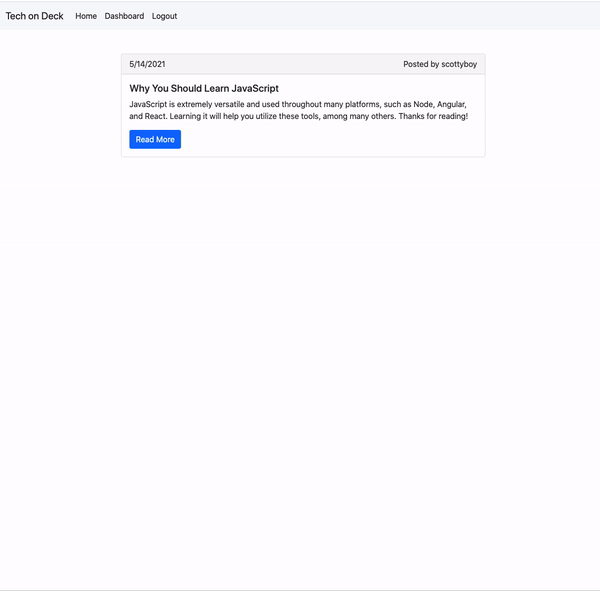

# Employee Tracker

## Description

The purpose of this application is to create a tech blog where users can create accounts, write blog posts, and comment on other users' posts.

I used the MCV design pattern to combine RESTful API, models, and handelbars views for an organized code structure.

## Functionality

* Users must be logged in to comment on posts.
* Once logged in, you'll gain access to a Dashboard where you can create new posts and view your existing posts.
* Users can edit and delete posts they've created.

## NPM Packages
I used the following npm packages to build this application:
* mysql2
* sequelize
* bcrypt
* dotenv
* express
* express-handlebars
* express-sessions
* connect-session-sequelize

## Live App

This app is deployed through Heroku [here](https://blooming-gorge-05033.herokuapp.com/).

